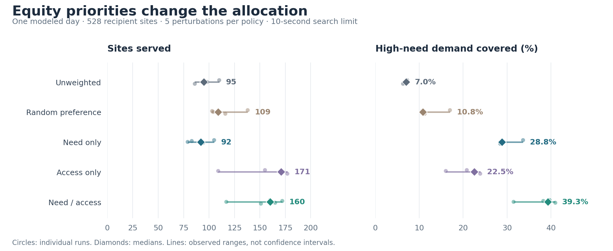

# NYC Food Insecurity and Food Rescue

[](https://github.com/skylarhezhentian/FoodInsecurityInNYC/actions/workflows/tests.yml)

**Laidlaw research at Columbia University · Skylar Tian**

Food-rescue routes can reach many sites while leaving high-need neighborhoods
underserved. This project studies where food access is limited in New York City
and how a constrained delivery fleet could balance broad coverage with
neighborhood need.

The research combines public provider records, neighborhood geography, and
food-insecurity indicators to measure access, build a delivery scenario, and
compare routing priorities with OR-Tools. This repository brings together the
data preparation, donor-supply exploration, routing experiments, Laidlaw poster,
and subsequent model corrections. The included routing scenario has **528
recipient sites, 18 donor candidates, two depots, and 25 vehicles**.

[Poster](poster/Skylar_Tian_Laidlaw_Poster.pdf) ·
[Research walkthrough](research/README.md) ·
[Run the project](docs/reproduce.md) ·
[Data and sources](data/README.md)

## From neighborhood analysis to routing

| Stage | Work and outputs |
| --- | --- |
| Understand need and access | [Public-data preparation and access maps](research/preprocessing/README.md), including a population-based accessibility measure across 197 residential neighborhoods. |
| Build the scenario | [Recipient joins, demand, delivery windows, and fleet assumptions](research/experiments/README.md#rebuild-the-final-instance). Donor-volume estimates are supporting research; the final pickup quantities are scenario assumptions. |
| Compare allocation policies | [Model development and experiments](research/experiments/README.md): prototypes, five-policy comparisons, an equity-weight sweep, and robustness and distributional analyses. |
| Present the Laidlaw study | [55 saved runs](data/study/replicates.json), [reproduced figures and tables](results/poster/), the [working paper](research/writing/README.md), and [poster with layout source](poster/README.md). |
| Correct and validate the model | [Current routing model](src/food_rescue/routing.py) and [25 saved solves](results/corrected/), with service-time and cargo constraints checked by independently replaying every route. |

The poster records the original study. The current benchmark is a later stage
of the same project, with corrected constraints and different initial cold
staging. Their results remain labeled by model version.

## Current routing results

In the corrected comparison, need/access priorities gave the highest median
high-need coverage; access-only priorities reached the most sites. Both used
more total route time than the unweighted baseline. The table shows medians
across five small penalty perturbations per policy.

| Policy | Sites served | High-need demand covered |
| --- | ---: | ---: |
| Unweighted | 95 | 7.0% |
| Random preference | 109 | 10.8% |
| Need only | 92 | 28.8% |
| Access only | 171 | 22.5% |
| Need / access | 160 | 39.3% |

High-need coverage is demand-weighted within the 240 sites carrying the supplied
high-need label. The ranges below show sensitivity to the small perturbations and
bounded search; they are not confidence intervals or evidence of a universal
policy ranking.



These are modeled allocations, not observed deliveries or estimates of reduced
food insecurity. Search is time-limited; another run can find different routes.
All 25 saved solves include their full routes, inputs, settings, and checks in
[results/corrected](results/corrected). See [full results and timing](docs/results.md)
and the [methods](docs/methodology.md) for the objective, metrics, and assumptions.

## Run it

Use Python 3.11. All inputs for the documented commands are included; no API key
or data download is needed.

```bash
python3.11 -m venv .venv
source .venv/bin/activate
python -m pip install -r requirements.txt
python scripts/reproduce_results.py
python scripts/reproduce_poster_figures.py
python scripts/verify_poster_archive.py
python scripts/verify_benchmark.py
```

These commands reproduce the original study tables and poster figures, then
independently check all saved corrected routes. They do not run the optimizer.

Use `python scripts/run_routing_demo.py` for a small new routing example.
The [run guide](docs/reproduce.md) covers the complete research sequence,
including the earlier maps and donor estimates in a separate Python 3.12
environment, instance reconstruction, and the full corrected benchmark.

## Repository guide

| Folder | Contents |
| --- | --- |
| `src/food_rescue/` | Current routing model, route audit, and saved-study analysis. |
| `scripts/` | Entry points for data preparation, result replay, figures, routing, and integrity checks. |
| `data/` | Public source snapshots, intermediate tables, model inputs, original saved study, and provenance. |
| `configs/` | Fixed settings for the corrected five-policy comparison. |
| `research/` | Research walkthrough, preprocessing, historical solvers, experiment development, and working-paper drafts. |
| `poster/` | Original Laidlaw poster PDF, recovered layout source, references, and figure-to-evidence guide. |
| `results/poster/` | Reproduced original-study figures, tables, and validation records. |
| `results/corrected/` | All 25 new route records, summaries, and verification evidence. |
| `docs/` | Methods, experiment protocol, reproduction guide, and figures. |
| `tests/` | Data integrity, accounting, feasibility, and saved-result regression tests. |

## Data and research limits

Locations and neighborhood indicators come from public sources. Supply, demand,
fleet, and cold-share quantities are scenario assumptions. The cached travel
estimates may include distance-based fallbacks, and their historical coordinate
alignment cannot be independently certified. [Data provenance](data/README.md)
records these limits and the source attribution.

The earlier full-study solver omitted service time and allowed inconsistent
cold/ambient inventory. Its 55 saved outputs remain available for
[accounting reproduction](docs/historical_results.md). The current model corrects
those constraints and changes initial cold staging; the two sets of results
describe different scenarios.

## Acknowledgments

Skylar Tian · Columbia University · Laidlaw Undergraduate Research and Leadership
Program. Faculty mentor: George Dragomir.

Travel estimates use OSRM and © [OpenStreetMap contributors](https://www.openstreetmap.org/copyright).
