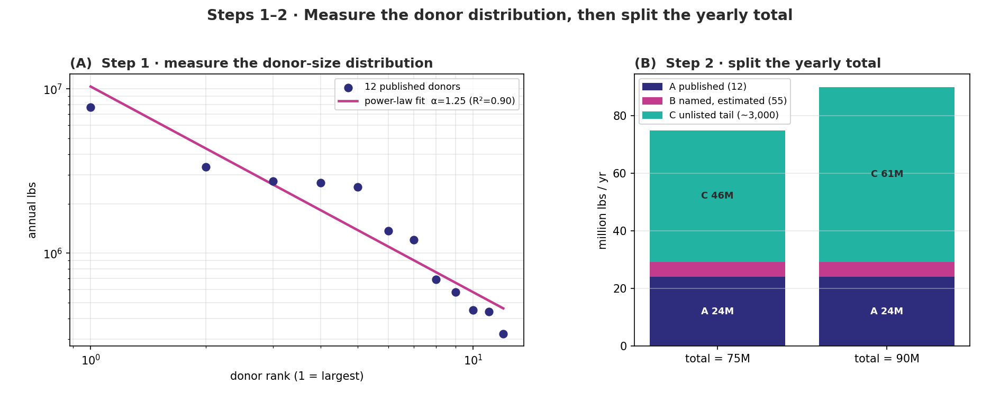
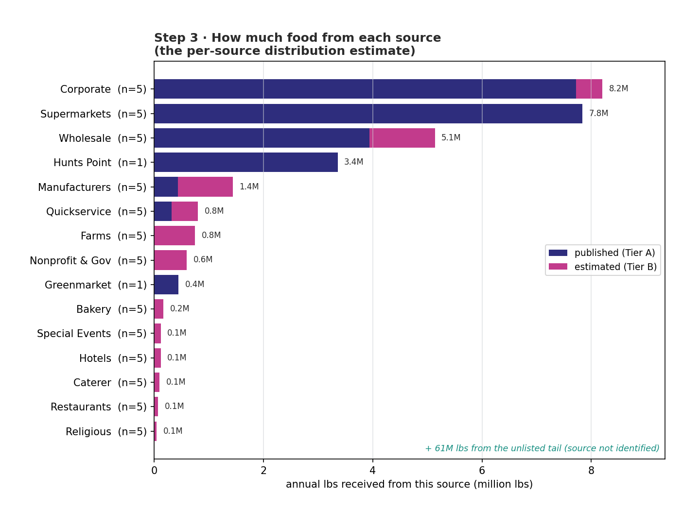
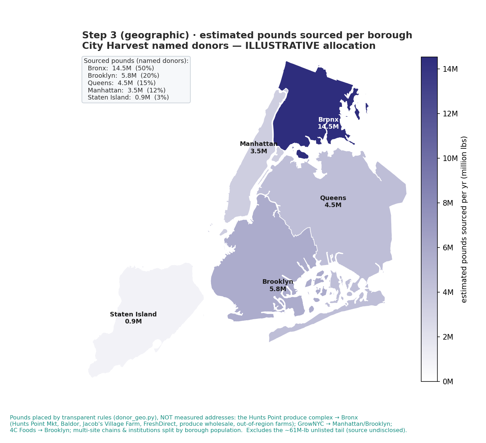

# From a Partial Donor List to a Per-Source Distribution Estimate

The pipeline is split across two figures. **Steps 1–2** (measure the distribution, split the total)
are in `figures/steps_1_2.png`; **Step 3** (the per-source estimate) is in
`figures/step_3_per_source.png`. Colours follow the teal / magenta / navy / grey scheme of the NYC
bivariate need×access map (`src/palette.py`): **navy = published/known**, **magenta =
estimated**, **teal = unlisted tail**.

**Steps 1–2 — measure, then split:**

**Step 3 — how much from each source:**

---

## Figure caption

**Figure. Three-step pipeline that turns City Harvest's partial public donor list into an
estimate of how much food is received from each source.**
**(A)** The 12 donors with published poundage, ranked largest-to-smallest on log–log axes; the
orange line is a fitted power law (α = 1.25, R² = 0.90) summarising how steeply donation size
falls with rank. **(B)** The yearly total, reconciled into three channels — *A* published top-12
(blue), *B* named donors with no published amount (orange), and *C* the unlisted "long tail"
(green) — shown for two assumed yearly totals (75M and 90M lbs). **(C)** The identifiable (named)
volume attributed to each source category: blue = pounds actually published, orange = pounds
estimated from category recovery rates; bar labels are the per-source totals. The ~60.8M-lb green
tail (panel B) is real volume whose individual sources City Harvest does not disclose, so it does
not appear in panel C. Together the panels read left-to-right as **measure shape → split the total
→ attribute to sources.**

---

## How the figure is obtained

The figures are produced by `src/fig_steps12.py` (panels A, B) and `src/fig_step3.py` (panel C),
which re-run the model and draw each stage of the pipeline:

**Panel A — measure the donor-size distribution (Step S2).**
We take the only hard data we have — the 12 published poundages — sort them largest to smallest,
and plot rank vs. size on log–log axes. A straight line on these axes means "each step down the
ranking multiplies the donation by a roughly constant factor." The fitted slope (α) is a single
number for how unequal the donors are. This panel establishes that the data are **heavy-tailed**: a
few giants (Amazon ≈ 7.7M lbs) and a steep drop-off.

**Panel B — split the yearly total (Step S4).**
City Harvest publishes a yearly rescue total (~90M lbs). We hold the 12 published donors fixed
(channel **A** = 24.1M lbs), estimate the 55 named-but-unquantified donors from category rates
(channel **B** = 5.2M lbs), and let the **unlisted tail** absorb whatever remains so the parts add
back to the published total (channel **C** = 60.8M lbs). This "make-the-parts-sum-to-the-known-total"
step is called **raking**. The bar is drawn for two total assumptions to show the split is stable.

**Panel C — attribute the named volume to each source (Steps S3 + S4).**
For every source category we add up (i) the **published** pounds from any Tier-A donors in it (blue)
and (ii) the **estimated** pounds for its named Tier-B donors (orange = number of donors × the
category's recovery rate). Sorting the bars gives a ranked picture of **how much food comes from
each type of source**. This is the panel that answers the practical question.

> **One-line data flow:** `12 published numbers → fit shape (A) → rake to the yearly total (B) →
> group the named donors by source (C)`.

---

## The Q–Q test — why we are allowed to fill in the blanks

Panel C estimates pounds for donors whose amounts we never observed. That is only legitimate if the
donations follow a predictable pattern. The **Q–Q (quantile–quantile) plot** (`fig2_lognormal_qq.png`)
is the check that they do.

**What it is, plainly.** We assume donation sizes follow a **log-normal** distribution — i.e. once
you take the *logarithm* of each donation, the values form an ordinary bell curve. The Q–Q plot
tests that assumption visually: it sorts the 12 real (logged) donations and plots them against the
values a perfect bell curve would have produced. **If the assumption holds, the dots fall on a
straight line.**

**What we see.** The 12 dots track the straight reference line closely across the whole range, with
only mild wiggle at the ends (expected with just 12 points). So the log-normal model is an adequate
description of donor sizes.

**Why it matters for the pipeline.** Because the shape is well-behaved, we can responsibly:
- read a single inequality parameter off panel A,
- give each unobserved donor a *distribution* of plausible sizes (not just a point), and
- attach uncertainty bands to the panel-C estimates.

In short: the Q–Q plot is the receipt that justifies the imputation feeding panel C. (It is shown
separately rather than stitched in, because it validates the method rather than reporting a result.)

---

## Method: estimating how much we distribute from each source

The goal is a number for **each source: how many pounds per year flow through it.** We reach it in
four moves.

1. **Anchor on what's published.** The 12 disclosed donors are taken as ground truth and assigned to
   their source category (e.g. Supermarkets, Wholesale, Hunts Point).
2. **Borrow the shape, not the level.** The heavy-tailed shape from panel A tells us the *pattern* of
   donor sizes. The Q–Q plot confirms the pattern is log-normal, so unobserved donors inherit it.
3. **Price each source with a recovery rate.** Each category gets an expected *lbs-per-donor* rate.
   Where a category's only example is a mega-outlier (Amazon for "Corporate"), we deliberately do
   **not** let that set the rate — we use a sector-grounded prior instead, so the rate transfers to
   ordinary donors. Multiplying rate × number of donors gives the estimated (orange) pounds.
4. **Force consistency with the known total (raking).** Published + estimated + unlisted tail are
   reconciled to add up to the yearly total. This prevents the per-source numbers from silently
   over- or under-counting.

The output is panel C plus the table below: **a ranked, per-source pounds-per-year estimate**, with
each bar split into the part we *know* (blue) and the part we *infer* (orange).

### Per-source estimate (the numbers behind panel C)

| Source category | Published (lbs) | Estimated (lbs) | **Total (lbs)** |
|---|--:|--:|--:|
| Corporate | 7,720,123 | 480,000 | **8,200,123** |
| Supermarkets | 7,836,183 | 0 | **7,836,183** |
| Wholesale | 3,938,029 | 1,200,000 | **5,138,029** |
| Hunts Point | 3,360,391 | 0 | **3,360,391** |
| Manufacturers | 441,037 | 1,000,000 | **1,441,037** |
| Quickservice | 323,093 | 480,000 | **803,093** |
| Farms | 0 | 750,000 | **750,000** |
| Nonprofit & Gov | 0 | 600,000 | **600,000** |
| Greenmarket | 449,493 | 0 | **449,493** |
| Bakery | 0 | 175,000 | **175,000** |
| Hotels | 0 | 125,000 | **125,000** |
| Special Events | 0 | 125,000 | **125,000** |
| Caterer | 0 | 100,000 | **100,000** |
| Restaurants | 0 | 75,000 | **75,000** |
| Religious | 0 | 50,000 | **50,000** |
| **Named subtotal (A + B)** | **24,068,349** | **5,160,000** | **29,228,349** |
| Unlisted tail (C) | — | — | **60,771,651** |
| **Yearly total** | | | **90,000,000** |

### From "source type" to a geographic map

Panel C answers "how much from each **source type**." To turn that into a literal **geographic**
view we add a borough choropleth (`figures/step_3_map.png`, code `src/fig_step3_map.py` +
`src/donor_geo.py`), using real NYC borough boundaries (NYC Open Data / GeoJSON) rendered in plain
matplotlib — no geopandas, since pandas is broken here.

**How pounds are placed (transparent, editable — `donor_geo.py`).** The page has **no addresses**, so
this is an *illustrative allocation*, not measured geography. Two rule types:

- **Confident facility assignments.** The Hunts Point produce complex → **Bronx** (Hunts Point
  Produce Market, Baldor, Jacob's Village Farm, FreshDirect, produce wholesale, and out-of-region
  farms that enter NYC through Hunts Point); GrowNYC → Manhattan/Brooklyn by its named markets;
  4C Foods → Brooklyn.
- **Population split.** Genuinely multi-site chains and institutions (Amazon, Costco, supermarkets,
  QSR, hotels, houses of worship…) are spread across boroughs by resident-population share — a
  documented proxy you can swap for food-retail establishment counts (Census CBP, NAICS 445).

**Result (named donors only, 29.2M lbs):** **Bronx 50 % · Brooklyn 20 % · Queens 15 % · Manhattan
12 % · Staten Island 3 %.** The Bronx dominance is the defensible signal — ~11.8M lbs of it comes
from *confident* Hunts Point assignments, independent of the population key. The ~61M-lb unlisted
tail is undisclosed and **excluded** from the map (same scope as the panel-C bars).

**Upgrade path to a true NTA map (like the reference).** Replace the borough rules with geocoded
donor pickup addresses → assign to NTAs → optionally weight by the distance-decay kernel
(`fig6_distance_decay.png`). At that point the choropleth becomes measured rather than illustrative,
and can be drawn at neighbourhood resolution.

---

## Caveats

- The orange (estimated) pounds rest on category recovery-rate **priors**; they are order-of-magnitude,
  and the named body is small (≈5M lbs) next to the tail, so panel C's *named* ranking is robust but
  its absolute estimates are indicative.
- The green tail (≈61M lbs, two-thirds of all volume) is **not** broken out by source here — by
  definition its donors are undisclosed. Any per-source view from this page necessarily describes only
  the identifiable third of the supply.
- Published totals are website figures; the 75M/90M pair in panel B is the honesty band around that.
